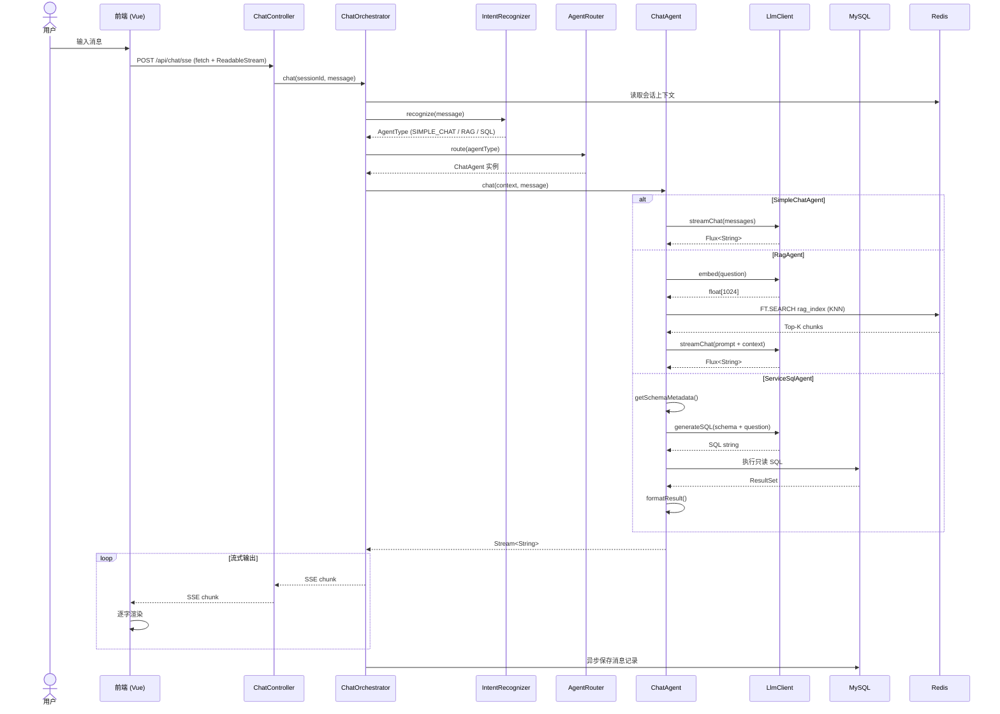
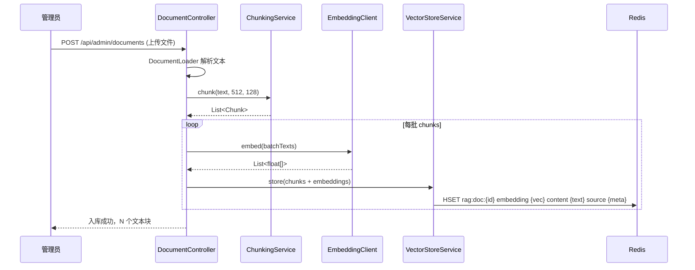
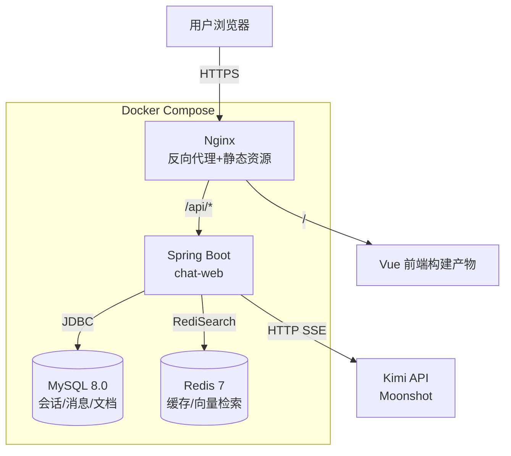

# 项目架构文档

## 1. 目录结构

```
multi-agent-chat/
├── docker-compose.yml                 # 本地开发环境编排（MySQL + Redis + Nginx）
├── nginx/
│   └── default.conf                   # 本地开发反向代理配置
├── openapi.yaml                       # 前后端 REST / SSE API 契约
├── README.md                          # 本地开发与验证命令
├── CLAUDE.md                          # Claude Code 协作指南
├── memory-bank/                       # 项目文档
│   ├── prd.md
│   ├── tech-stack.md
│   ├── implementation-plan.md
│   └── architecture.md                # 本文档
│
├── backend/                           # 后端 Maven 多模块项目
│   ├── pom.xml                        # 父 POM，统一依赖版本
│   ├── common/                        # 公共工具模块
│   │   └── src/main/java/com/company/chat/common/
│   │       ├── exception/             # 全局异常类
│   │       ├── constants/             # 常量定义
│   │       └── util/                  # 通用工具
│   │
│   ├── chat-api/                      # 接口契约模块（所有模块依赖）
│   │   └── src/main/java/com/company/chat/api/
│   │       ├── agent/
│   │       │   ├── ChatAgent.java
│   │       │   ├── AgentType.java
│   │       │   └── ChatContext.java
│   │       ├── router/
│   │       │   └── AgentRouter.java
│   │       ├── intent/
│   │       │   └── IntentRecognizer.java
│   │       └── llm/
│   │           ├── LlmClient.java
│   │           └── EmbeddingClient.java
│   │
│   ├── agent-simple/                  # 简单对话 Agent
│   │   └── src/main/java/com/company/chat/agent/simple/
│   │       └── SimpleChatAgent.java
│   │
│   ├── agent-rag/                     # RAG 知识检索 Agent
│   │   └── src/main/java/com/company/chat/agent/rag/
│   │       ├── RagAgent.java
│   │       ├── DocumentLoader.java
│   │       ├── ChunkingService.java
│   │       └── VectorStoreService.java
│   │
│   ├── agent-sql/                     # SQL 数据查询 Agent
│   │   └── src/main/java/com/company/chat/agent/sql/
│   │       ├── ServiceSqlAgent.java
│   │       ├── SchemaMetadataService.java
│   │       ├── SqlGenerationService.java
│   │       └── SqlExecutionService.java
│   │
│   └── chat-web/                      # Web 主模块（Controller + 编排）
│       └── src/main/java/com/company/chat/web/
│           ├── controller/
│           │   └── ChatController.java
│           ├── dto/                   # REST API 请求 / 响应 DTO
│           │   ├── ChatMessageRequest.java
│           │   ├── ChatMessageResponse.java
│           │   ├── CreateSessionRequest.java
│           │   └── SessionSummaryResponse.java
│           ├── orchestrator/
│           │   └── ChatOrchestrator.java
│           └── config/
│               └── WebConfig.java
│       └── src/main/resources/
│           ├── application.yml        # 环境变量化的数据源 / Redis / Flyway 配置
│           ├── db/migration/
│           │   └── V1__create_chat_schema.sql
│           └── redis/
│               ├── create-rag-index.redis
│               └── redis-data-structures.md
│
└── frontend/                          # Vue 3 前端项目
    ├── package.json
    ├── index.html
    ├── vite.config.ts
    ├── tsconfig.json
    ├── eslint.config.js
    ├── .prettierrc
    └── src/
        ├── main.ts                    # 入口
        ├── App.vue
        ├── api/                       # HTTP 请求封装
        │   ├── chat.ts
        │   └── session.ts
        ├── components/                # 业务组件
        │   ├── ChatPanel.vue          # 聊天主面板
        │   ├── MessageList.vue        # 消息列表
        │   ├── MessageItem.vue        # 单条消息
        │   ├── ChatInput.vue          # 输入框
        │   └── SessionSidebar.vue     # 会话侧边栏
        ├── stores/                    # Pinia 状态管理
        │   └── chatStore.ts
        ├── types/                     # TypeScript 类型
        │   └── chat.ts
        └── utils/
            └── markdown.ts            # Markdown 渲染工具
```

---

## 2. 模块职责

### 2.1 后端模块

| 模块 | 职责 | 依赖 |
|------|------|------|
| `common` | 全局异常、常量、通用工具（日期、JSON、脱敏） | 无 |
| `chat-api` | **接口契约层**。定义 `ChatAgent`、`AgentRouter`、`IntentRecognizer`、`LlmClient` 等核心接口，以及 DTO 对象 | `common` |
| `agent-simple` | 简单对话 Agent 实现。透传用户消息到 LLM，流式返回 | `chat-api` |
| `agent-rag` | RAG Agent 实现。文档分块、Embedding、向量检索、带引用生成 | `chat-api` |
| `agent-sql` | Service SQL Agent 实现。Schema 采集、NL2SQL、只读执行、结果格式化 | `chat-api` |
| `chat-web` | Web 入口。Controller（SSE 端点）、对话编排（Orchestrator）、路由注册 | `chat-api` + 所有 Agent 模块 |

### 2.1.1 API 契约现状

Step 0.2 已完成第一版 `openapi.yaml`，覆盖以下端点：

| 方法 | 路径 | 说明 |
|------|------|------|
| `POST` | `/api/chat/sse` | 接收用户消息并以 `text/event-stream` 流式返回 Agent 输出 |
| `GET` | `/api/sessions` | 获取会话列表 |
| `POST` | `/api/sessions` | 创建新会话 |
| `DELETE` | `/api/sessions/{id}` | 删除或清空会话 |
| `GET` | `/api/sessions/{id}/messages` | 获取会话历史消息 |

后端 `chat-web` 当前只提供 Controller 与 DTO 存根，真实会话持久化和 Agent 编排在 Phase 1.4 接入。前端已提供同名 TypeScript 类型和 `fetch` API 壳，其中 `/api/chat/sse` 使用 `fetch + ReadableStream` 适配 POST 流式响应。

### 2.2 前端目录

| 目录/文件 | 职责 |
|-----------|------|
| `api/` | Axios 封装，提供 `sendChatMessage`、`getSessions` 等函数，统一处理 SSE 连接 |
| `components/ChatPanel.vue` | 聊天页面布局容器，组合 MessageList + ChatInput + SessionSidebar |
| `components/MessageItem.vue` | 单条消息渲染，区分用户/机器人，支持 Markdown、代码高亮、表格 |
| `stores/chatStore.ts` | Pinia Store，管理当前会话 ID、消息列表、会话列表、加载状态 |
| `utils/markdown.ts` | 封装 `marked` + `highlight.js`，提供 `renderMarkdown(text)` 函数 |

---

## 3. 核心数据流

### 3.1 对话主链路



### 3.2 RAG 文档入库流程



---

## 4. 接口定义

### 4.1 ChatAgent（所有 Agent 实现）

```java
public interface ChatAgent {
    /**
     * 处理用户消息，返回流式响应
     * @param context 会话上下文（含历史消息）
     * @param userMessage 当前用户输入
     * @return 流式字符串输出
     */
    Stream<String> chat(ChatContext context, String userMessage);
}
```

**实现类**：
- `SimpleChatAgent`：透传 LLM
- `RagAgent`：检索增强生成
- `ServiceSqlAgent`：NL2SQL 查询

### 4.2 AgentRouter

```java
public interface AgentRouter {
    /**
     * 根据意图类型获取对应 Agent 实例
     */
    ChatAgent route(AgentType agentType);
}
```

### 4.3 IntentRecognizer

```java
public interface IntentRecognizer {
    /**
     * 识别用户意图
     * @param userMessage 用户原始输入
     * @return 目标 Agent 类型
     */
    AgentType recognize(String userMessage);
}
```

**实现类**：
- `KeywordIntentRecognizer`：基于关键词规则（初版）
- `LlmIntentRecognizer`：基于 LLM 判断（升级版）

### 4.4 LlmClient

```java
public interface LlmClient {
    /**
     * 流式对话
     * @param messages 消息列表（含系统提示、历史、当前问题）
     * @return Flux<String> 逐字流式输出
     */
    Flux<String> streamChat(List<Message> messages);
}
```

**实现类**：
- `KimiLlmClient`：Moonshot API（默认）
- `OpenAiLlmClient`：OpenAI API（备选）
- `LocalLlmClient`：本地部署模型（私有化）

### 4.5 EmbeddingClient

```java
public interface EmbeddingClient {
    /**
     * 批量文本向量化
     * @param texts 文本列表
     * @return 向量列表（Kimi 为 1024 维）
     */
    List<float[]> embed(List<String> texts);
}
```

**实现类**：
- `KimiEmbeddingClient`：Moonshot Embedding API

---

## 5. 数据模型

### 5.1 MySQL 表结构

DDL 脚本位置：`backend/chat-web/src/main/resources/db/migration/V1__create_chat_schema.sql`。当前第一版包含 `chat_session`、`chat_message`、`kb_document` 三张表，并通过 Flyway 作为应用启动迁移入口。

```sql
-- 会话表
CREATE TABLE chat_session (
    session_id   VARCHAR(64) PRIMARY KEY,
    user_id      VARCHAR(64) NOT NULL,
    title        VARCHAR(255) NOT NULL DEFAULT 'New chat',
    created_at   DATETIME(3) NOT NULL DEFAULT CURRENT_TIMESTAMP(3),
    updated_at   DATETIME(3) NOT NULL DEFAULT CURRENT_TIMESTAMP(3) ON UPDATE CURRENT_TIMESTAMP(3),
    INDEX idx_chat_session_user_updated (user_id, updated_at)
) COMMENT='会话表';

-- 消息表
CREATE TABLE chat_message (
    message_id   BIGINT AUTO_INCREMENT PRIMARY KEY,
    session_id   VARCHAR(64) NOT NULL,
    role         VARCHAR(32) NOT NULL,
    content      TEXT NOT NULL,
    agent_type   VARCHAR(32),
    created_at   DATETIME(3) NOT NULL DEFAULT CURRENT_TIMESTAMP(3),
    INDEX idx_chat_message_session_created (session_id, created_at),
    CONSTRAINT fk_chat_message_session
        FOREIGN KEY (session_id) REFERENCES chat_session (session_id)
        ON DELETE CASCADE
) COMMENT='消息表';

-- 知识库文档表
CREATE TABLE kb_document (
    doc_id       VARCHAR(64) PRIMARY KEY,
    file_name    VARCHAR(255) NOT NULL,
    title        VARCHAR(255) NOT NULL,
    source_uri   VARCHAR(1024),
    content      LONGTEXT NOT NULL,
    total_chunks INT NOT NULL DEFAULT 0,
    created_at   DATETIME(3) NOT NULL DEFAULT CURRENT_TIMESTAMP(3),
    updated_at   DATETIME(3) NOT NULL DEFAULT CURRENT_TIMESTAMP(3) ON UPDATE CURRENT_TIMESTAMP(3)
) COMMENT='知识库文档';
```

### 5.2 Redis 数据结构

详细规范位置：`backend/chat-web/src/main/resources/redis/redis-data-structures.md`。RediSearch 索引脚本位置：`backend/chat-web/src/main/resources/redis/create-rag-index.redis`。

| Key 模式 | 类型 | 用途 | TTL |
|----------|------|------|-----|
| `chat:context:{sessionId}` | Hash | 会话上下文缓存（最近 N 条消息摘要） | 24h |
| `ratelimit:user:{userId}` | String | 用户请求限流计数 | 1min |
| `rag:doc:{docId}:chunk:{chunkIdx}` | Hash | 文本块内容 + 向量 + 元数据 | 永久 |
| `sql:schema:metadata` | String | 表结构元数据缓存（JSON） | 10min |

`rag_index` 使用 HNSW + COSINE，向量字段为 1024 维 `FLOAT32`，匹配 Kimi / Moonshot Embedding 维度。

---

## 6. 部署架构



本地开发 Compose 默认发布端口为 MySQL `3306`、Redis `6379`、Nginx `80`。如果宿主机已有服务占用端口，可通过 `MYSQL_HOST_PORT`、`REDIS_HOST_PORT`、`NGINX_HOST_PORT` 覆盖，例如：

```bash
MYSQL_HOST_PORT=13306 REDIS_HOST_PORT=16379 NGINX_HOST_PORT=8088 docker compose up -d
```

---

## 7. 关键设计决策

| 决策 | 说明 |
|------|------|
| **接口先行** | `chat-api` 模块先定义所有接口，Agent 模块仅依赖接口，不耦合实现 |
| **SSE 流式** | 后端通过 `SseEmitter` 输出 `text/event-stream`；由于契约使用 `POST /api/chat/sse`，前端通过 `fetch + ReadableStream` 接收流 |
| **Redis 向量** | 使用 RediSearch 模块存储 Embedding，避免引入 Milvus/Qdrant 等额外组件 |
| **SQL 只读** | SQL Agent 通过连接池配置或 SQL 解析强制拦截写操作，防止数据破坏 |
| **Prompt 外置** | 所有 Prompt 模板放在 `resources/prompts/*.yaml`，不硬编码，便于调优 |
| **无 Spring Security** | 鉴权由企业网关或 Nginx 统一处理，应用层不做认证 |

---

*本文档随代码迭代更新。*
